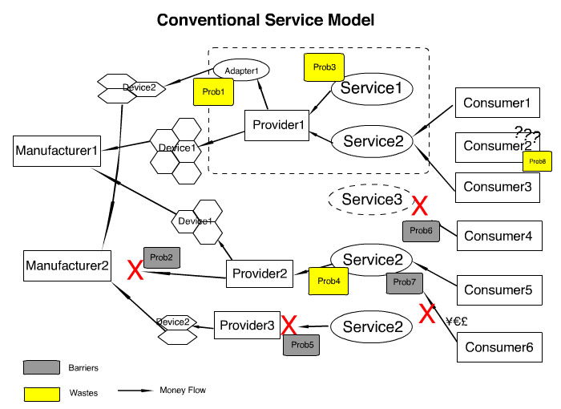
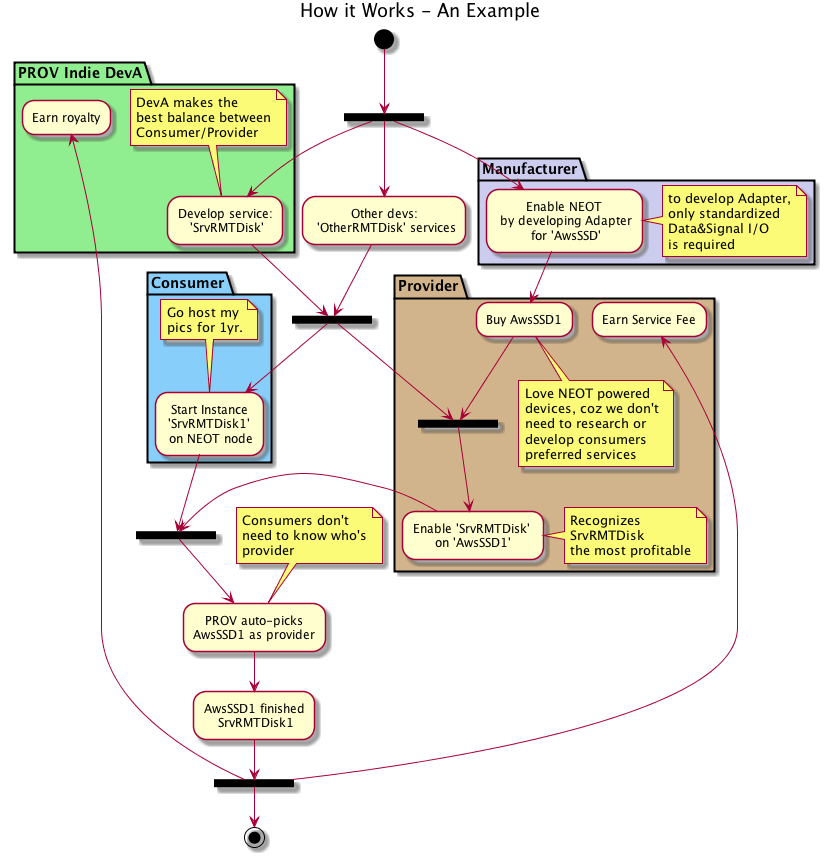
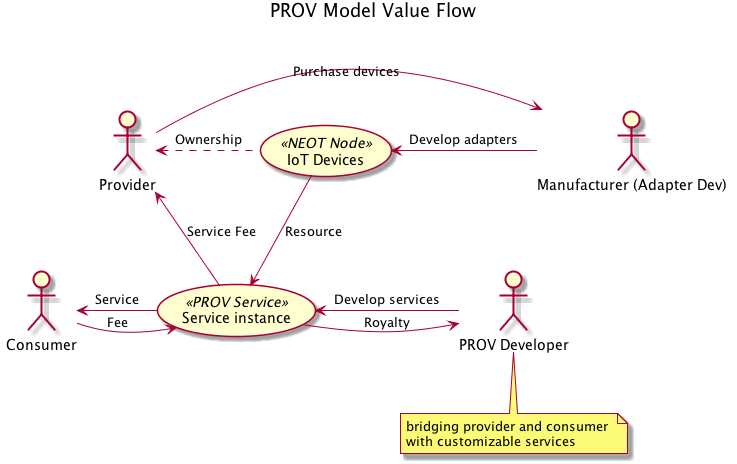
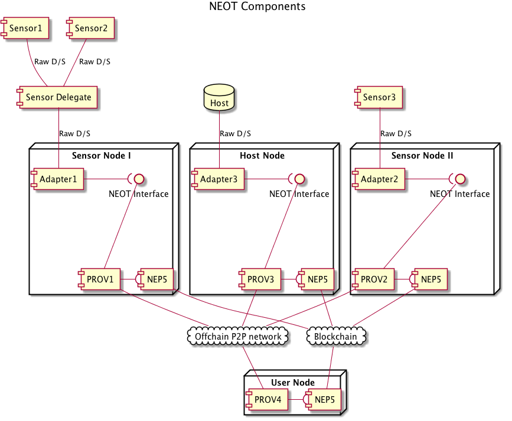

# NEO of Things (NEOT) 

The IoT Infrastracture powered by NEO

[TOC]

## Abstract

Internet of Things (IoT), has recently gained much traction due to its potential for transforming business applications and everyday life. However, it's encountering many practical problems such as security, privacy, compatibility and statability. Distributed ledger technology emergying recently brings the hope of enhancing IoT network in many aspects. Some projects are under developing but still could not satisfy the requirement of performance. 

In this paper, we first discuss the common challenge of distributed ledger based IoT projects, then introduce a new blockchain based service model PROV to help overcome some practical problems. NEO as the best blockchain platform for IoT services, will be leveraged as the infrastructure of PROV, forming the project NEOT (NEO of Things). 

In the last part of this paper, we'll describe some NEOT user cases. The team of norchain.io has widely launched conversation with City of Marham, CGI Group, China Mobile, regarding to blockchain opportunities of contributing smart economy. We believe NEOT as the 1st practical IoT distributed ledger solution, will find it's chance to land very soon.

## 1. Challenges of IoT and related projects

### 1.0 IoT Background	

The Internet of Things or IoT for short has recently gained much traction due to its potential for transforming business applications and everyday life. IoT can be defined as a network of computationally intelligent physical objects that are capable of connecting to the Internet, sensing real-world events or environments, reacting to those events, collecting relevant data, and communicating it over the Internet. This simple definition has huge implications and has led to exciting concepts, such as wearable's, smart homes, smart grids, smart connected cars, and smart cities, that are all based on this basic concept of an IoT device.

Sensing, reacting, collecting, and communicating are four functions that come to light as being performed by an IoT device which are performed by using various components on the IoT device.

Generally, a five layer model can be used to describe IoT, which contains a physical object layer, device layer, network layer, services layer, and application layer. Each layer or level is responsible for various functions and includes various components.

But the above mentioned five-layer IoT model can be adapted to a blockchain-based model by adding a blockchain layer on top of the network layer. This layer will run contracts, and provide security, privacy, integrity, autonomy, scalability, and decentralization services to the IoT ecosystem. The management layer in this case can consist of only software related to analytics and processing, and security and control can be moved to the blockchain layer.

Understanding the different layers of IoT, identifying the areas of vulnerability in each layer and exploring technologies needed to counter each of the weaknesses are essential in dealing with the issue of IoT.

### 1.1 Challenges

#### Node capability

As an estimate from various researchers and companies, by 2020 there will be roughly 22 billion devices connected to the Internet. With this explosion of billions of devices connecting to the Internet, it is hard to imagine that centralized infrastructures will be able to cope with the high demands of bandwidth, services, and availability

Furthermore, most of IoT nodes have limited storage and calculation power. Since IoT ecosystems are very diverse. In contrast to generic computing networks, IoT networks are comprised of devices that have very different computing capabilities

Even in current blockchain based model, there are also experiencing uneven processing power and time required to perform encryption for all the objects involved in a blockchain-based ecosystem because not all of devices will be capable of running the same encryption algorithms at the desired speed. 

Some of major issues even found in current blockchain based model. 

- Firstly, the consensus algorithms employed in BC (POW or POS) require significant computational resources which are far beyond the capabilities of most IoT devices. 

- Secondly, Storage will be a hurdle. Blockchain eliminates the need for a central server to store transactions and device IDs, but the ledger has to be stored on the nodes themselves. And the ledger will increase in size as time passes. That is beyond the capabilities of a wide range of smart devices such as sensors, which have very low storage capacity.

- Thirdly, the throughput in blockchain is defined as the number of transactions that can be stored. Classical instantiations of Blockchain have limited throughput.

- Fourthly, there is a non-trivial delay associated with ensuring that a transaction is confirmed by nodes participating in the Blockchain. However most IoT applications have stricter delay requirements 

- Lastly, in a typical blockchain implementation, all blocks are broadcast to and verified by all nodes. This leads to significant scalability issues since the broadcast traffic and processing overheads would increase  with the number of nodes in network

Here are some of proposed solutions in the industry to the issues above:

- 
  A Lightweight Scalable Blockchain for IoT, which owns an IoT friendly consensus algorithm that eliminates the need for solving any puzzle prior to appending a block to the BC. A distributed trust method whereby the processing time for validating new blocks by the OBMs gradually decreases as they build up trust in each other. A distributed throughput management strategy adjusts certain system parameters to ensure that the network utilization is within a prescribed operating range.

- 
  BC-based multi-tier architecture to share data from IoT devices with organizations and people. This proposed architecture has three main components namely: data management protocol, data store system, and message service.

- A new consensus algorithm for BC known as Proof of Elapsed Time (POET) which is integrated with Hyperledger

- 
  A new ledger based cryptocurrency called IoTA. By eliminating the notion of blocks and mining, IoTA ensures that the transactions are free and verification is fast.

- 
  Ethereum Light client protocol is under development, which is to allow users in low-capacity environments (embedded smart property environments, smartphones, browser extensions, some desktops, etc) to maintain a high-security assurance about the current state of some particular part of the Ethereum state or verify the execution of a transaction

####  DDoS and Security

The normal IoT model is based on a centralized paradigm where IoT devices usually connect with a cloud infrastructure or central servers in order to report and process the relevant data back. This centralization poses certain possibilities of exploitation including hacking and data theft which can produce DDoS attacks. The attackers can cripple our infrastructure, systems, and way of life

Moreover, not having control of personal data on a single, centralized service provider also increases the possibility of security and privacy issues. the attackers can directly exploit a device and use it as a gateway to deeper levels of a network where they gather sensitive and valuable private data.

Blockchain technology leveraging randomlized peers brings the potiential of DDoS-resistant. 

Blockchain, a truly distributed system, has built-in protections against losing communication with nodes to ensure transactions can continue even if several nodes go offline. The nodes in the blockchain can run consensus algorithms – if several nodes are offline, others continue – even if they were taken offline by a DDoS attack. 

Peer-to-peer networks in the blockchain are notoriously hard to stop or even disrupt. Also, attacking the transactions is also close to impossible because they are stored in everyone’s copy of the blockchain and cryptographically verified by the mining process. hackers can target a centralized server or data center more easily but with blockchain's distributed and decentralized nature, such attacks are no longer possible. 

The cryptographic algorithms used by blockchains would make consumer data more private.

#### Connection stability

Connecting so many devices will be one of the biggest challenges of the future of IoT, and it will defy the very structure of current communication models and the underlying technologies. At present we rely on the centralized, server/client paradigm to authenticate, authorize and connect different nodes in a network.

The future of IoT will very much have to depend on decentralizing IoT networks. Part of it can become possible by moving some of the tasks to the edge, such as using fog computing models where smart devices such as IoT hubs take charge of mission-critical operations and cloud servers take on data gathering and analytical responsibilities

Other solutions involve the use of peer-to-peer communications, where devices identify and authenticate each other directly and exchange information without the involvement of a broker.

Current IoT ecosystems rely on centralized, brokered communication models, otherwise known as the server/client paradigm. All devices are identified, authenticated and connected through cloud servers that sport huge processing and storage capacities. cloud servers will remain a bottleneck and point of failure that can disrupt the entire network.

A blockchain-based IoT model differs from the traditional IoT network paradigm. decentralization, which is at the very core of blockchain technology, can eliminate single points of failure in an IoT network and create a more resilient ecosystem for devices to run on.  For example, a central server perhaps is not able to cope with the amount of data that billions of IoT devices (things) are producing at high frequency

#### Compatibility

Technology standards which include network protocols, communication protocols, and data-aggregation standards, are the sum of all activities of handling, processing and storing the data collected from the  sensors. This aggregation increases the value of data by increasing, the scale, scope, and frequency of data available for analysis.

Challenges facing the adoptions of standards within IoT:

1. Standard for handling unstructured data: Structured data are stored in relational databases and queried through SQL for example. Unstructured data are stored in different types of NoSQL databases without a standard querying approach.

2. Standard for handling IoT networking protocols:Connecting so many devices will be one of the biggest challenges of the future of IoT, and it will defy the very structure of current communication models and the underlying technologies. At present we rely on the centralized, server/client paradigm to authenticate, authorize and connect different nodes in a network.

The future of IoT will very much have to depend on decentralizing IoT networks. Part of it can become possible by moving some of the tasks to the edge, such as using fog computing models where smart devices such as IoT hubs take charge of mission-critical operations and cloud servers take on data gathering and analytical responsibilities

Other solutions involve the use of peer-to-peer communications, where devices identify and authenticate each other directly and exchange information without the involvement of a broker.

3. IoT networking constraints: 

	- Range
	- Bandwidth
	- Power usage
	- Intermittent connectivity
	- Interoperability
	- Security

4. Technical skills to leverage newer aggregation tools: Companies that are keen on leveraging big-data tools often face a shortage of talent to plan, execute, and maintain systems.

#### Affordability 

Existing IoT solutions are expensive because of the high infrastructure and maintenance cost associated with centralized clouds, large server farms, and networking equipment. The sheer amount of communications that will have to be handled when there are tens of billions of IoT devices will increase those costs substantially.

Blockchain based IoT can result in cost saving which is due to easier device management by using a
blockchain based decentralized approach. The IoT network can be optimized for performance by using blockchain. The peer-to-peer communication model provided by blockchain can help to reduce costs because there is no need to store IoT data centrally for millions of devices or implementation of complex public key infrastructure for security, the storage and processing requirements can also be distributed to all IoT devices on the blockchain. Devices can communicate with each other directly or via routers as well.

#### Maintenance

If as estimated there will be billions of devices connected to the Internet in the near future, it will become almost impossible to manage security and updates of all those devices from traditional centrally owned servers. 

Blockchain based IoT can provide a solution to this problem by allowing devices to communicate with each other directly in a secure manner and even request firmware and security updates from each other. On a blockchain network these communications can be recorded immutably and securely which will provide auditability, integrity, and transparency to the system. This is not possible with traditional P2P systems.

### 1.2 Recent IoT distributed ledger projects  

There are various projects already proposed providing blockchain-based IoT solutions. 

- IBM Blue Horizon and IBM Bluemix are IoT platforms supporting blockchain IoT platforms. 
- IBM and Samsung introduced their proof-of-concept system, ADEPT, which uses blockchain to support next-generation IoT ecosystems that will generate hundreds of billions of transactions per day.
- The Hyundai Digital Asset Company (HDAC) is pursuing IoT through a more traditional blockchain route. By tweaking a proof-of-stake protocol and utilizing an intriguing mix of private and public blockchains, HDAC has bumped the transaction speed considerably.

- Various start-ups such as Filament have already proposed novel ideas on how to build a decentralized network that enables devices on IoT to transact with each other directly and autonomously driven by smart contracts. Also there are others IoT projects such as IOTA, ITC and Steemr etc.

But Some of then are experimenting other decentralized topology. 

- The most famous one is IOTA. However, its light nodes rely on manual assigning public nodes as servers, which recently practially failed to resist DDoS attacks. Despite its impressive performance speed, several security concerns have been raised over its inherent nature and exact implementation of the tangle.

- 
  ITC doesn't have much process on their project. It's based on Ethereum, which means low speed and you need to pay gas for every conversation, which is not applicable for most IoT scenarios. 

- Steemr, providing beautiful user interface, is targeted to provide a market for offchain stream data. It's also based on Ethereum. Their network is so far running totally offchain with barely relationship with ERC20 token. 

### 1.3 IoT Trend  

IoT is continuing to evolve away from just connected devices, and converging with new technologies like AI and blockchain to help us be more productive.

The convergence of AI and IoT means that these physical devices can now see, hear and understand the world around them. They can make sense of the vast amount of unstructured data that is being produced and then provide businesses with more intelligent insights that enable more innovative uses which 
will directly benefit all of us - both professionally at work, and personally at home.

Blockchain will transform the transparency and assurance of transactions, and when you marry this with IoT, it enables IoT devices to share critical data across businesses and across processes.  This will help businesses across all industries to have a powerful tool to transform their business and ecosystem.

## 2 NEOT: The 1st Practical IoT Distributed Ledger Solution

### 2.1 The Problems

Sharing economy, as one of IoT's most important application, has three major players.

IoT **Manufacturer** produces the devices like sensors, hosts, etc. Many of them provide remote access interfaces and even developed their own IoT services. But the services are usually limited to manufacturer's own production lines and lack of standards. 

 **Provider**, by purchasing devices from manufacturers, run the business of renting the resources powered by their own software and even payment systems (cloud hosting, remote camera, etc.). 

**Consumers** speed money to subscript the service from providers. 

The value flow of convensional sharing economy service model is like this: 

As the example shown in the figure above, conventional service model has following problems:

1. Provider1 purchase Device1 and Device2 but manufactuerers doesn't provide unified interface. Provider1 has to develop adapters to make them compatiable with his system. Similiar thing happens to other providers and it caused a lot of redundancy. It's ideal if manufactuerers can provide standardized interface. However, they don't have such incentive unless standards setup and supported by enough strong parites.
2. For the same reason in problem 1, weaker provder (Provider2) who's running only Device1 finds it's unaffordable to adapt Device2. A loss for both parties.
3. as the dinosaur of the market, Provider1 spends huge money to develop new services, but only some of those can becomes successful. Service 1 has few subscribers and leaves a huge waste.
4.  Provider2 also want to run popular Service2. But he can only develop his own copy rather than shared by Provider1. Redundancy in the society's point of view.
5.  For the same reason, weaker provider (Provider3) can not afford developing Service2, then fade out of the market. It accelerates monopoly and in long term bad for consumers.
6. A lot of people like Consumer4 find that it would be fantastic if there's Service3. But unfortunately no provider knows this idea. 
7. Consumer6 wants to subscript Service2, however Provider2 cannot support his countries' currency or payment method.
8. Consumer2 wants to toggle from Provider1's Service1 to Provider2's Service2. This can never be for free and would cost a lot of time.

In the next section, we'll see what can introducing a new role make the change. 

### 2.2 PROV: How it works?

We would like to introduce a new business model, where a new role called PROV developer is added to the conventional one. 

PROV is a service interface based on distributed ledger. It stands for four main phases of a service incident: **Provision**, **Representation**, **Orientation** and **Verification**. PROV developers need to implement these four functions to release a service on blockchain.  

PROV developers can be anybody, PROV services can hold any logic. But only the reasonable ones with great provider/consumer interest balance can be supported by these parites.

Let's take the example of **remote storage** demonstrated in the following diagram to show PROV's typical work flow.

In the above example,

- Manufacturer M has a new high performance storge solution called AwsSSD. He developed an adapter to adapt AwsSSD's data and control interfaces to access NEOT.

- Indie developer D released a PROV compatiable service called "SrvRMTDisk" to enable remote storage sharing. At the meantime, other developers also released similiar services. 

- After scrutinizing all the remote storage services, provider P believed the combination of AwsSSD + SrvRMTDisk would be best profitable. So he bought AwsSSD1 from M and enabled SrvRMTDisk on it, configured it with a reasonable fee rate.

- Consumer C loved the service OtherRMTDisk better. but since SrvRMTDisk was supported by most providers, he chose to create an instance of SrvRMTDisk to store his large video remotely for 1 month. NEOT network, as D wrote into the Orientation method, picked AwsSSD1 as the provider with the following algorithm:

  1. AwsSSD1 had SrvRMTDisk enabled with enough idle resource
  2. C's wallet balance was enough to afford the service P offered.
  3. AwsSSD1 had good history of successfully running SrvRMTDisk: 120 times with 92% successful rate. This information is publicly recorded on blockchain.

  Since the algorithim is open without any randomization, all nodes including AwsSSD1 itself got to know that AwsSSD1 was chosen right after the service instance was created on blockchain. Related fund is frozen from C's wallet immediately.

- After service finished, according to Verification method, 95% of fund was deposited to P's wallet, and D takes 5% - That's the rate D wrote into SrvRMTDisk, the rate for senior providers. If this was AwsSSD1's 1st time or if it has only 20% successful rate, P would have taken 80% instead.  This strategy makes providers stick on their quality of service, and also makes customer trust the service more. 

### 2.3 PROV: What will be changed?

As we can see from previous example, by adding the extra role PROV developer, let's go over the problems mentioned in section 2.1 again.

1. Problem 3,4,5: Providers are no longer expected to develop the services. PROV services are shared with everybody and there will be fewer redundancy. 
2. Problem 6: If a group of consumers really want some new service, there would always be some indie developers smell it and make it happen.
3. Problem 7: On blockchain, we have unique payment currency globally.
4. Problem 8: If a service setup a barrier to avoid consumers from leaving, consumers would find there before subsciption. There will be many better choices.
5. Problem 1&2: With so many benefits listed above, manufactuerers will be happy to adapt to PROV service.   

The flow of the value is changed to be like this.

Leveraging the power of PROV standard, all parties are motivated to improve the ecosystem. The above figure demonstrates the flow of the value following the arrow's direction:

- *Consumers* pay the fee and enjoy the PROV services provided by NEOT device nodes. 
- *PROV Developers* develop the PROV services, if the services are functional and fair enough, consumers will employ the device nodes via their services, and *PDNE Developers* can profit with the royalty.
- *Providers* shares their resource by the devices they owned, and profit by the service fee.
- *Adapter Developers*, in many cases the device manufacturers, develop the adapters to access the devices to NEOT's network, and attract more people to buy their devices to run the business.

For more technology details about how to implement PROV, please read our yellow paper [HERE](https://github.com/NEOCompToronto/NEOCompetition/blob/master/PROV.ipynb). 

### 2.4 NEOT: Components

The following figure demonstrates the key components in NEOT's network and their relationships.

#### Sensor 

*Sensor* is the ultimate information capturer of the really world and the devices of existing IoT networks. A typical *sensor*:

1. has unidirectional **Data** output, with the form of pulsing, streaming, etc. The encoding of *data* may or may not conform to international standards. 
2. has an instruction set for remote configuration and controlling. Some also implement the status query functionalities and the feedback/acknowledge machanism. We define this set as bidirectional **Signals**. 
3. is not designed to handle heavy computational work or persist huge volume of data, in order to reduce the manufacture cost and battery consumption.
4. in many scenarios, is exposed in unstable communication environment. 
5. in many scenarios, pairs with, or as an element of a *sensor* cluster connects with a **Sensor Delegate**. The *delegate*, which can be a specialized hardware, or an API mounted in a common device, also provides *data* and *signal* interfaces. In the NEOT's point of view, *sensor delegate* is equivalent to *sensor* as they both provide bidirectional signal and unidirectional data interfaces. Therefore we see these delegates as "sensors" to simplify the description.

One NEOT node is capable to attach multiple *sensors*. A node attached with at least one *sensor*  is call a NEOT **Sensor Node (SN)** .

*Sensor nodes* act as the service provider in *Private Data* user cases, while the consumer in *Public Data* user cases. Check session 2.5 for the details of these user cases. 

#### Host

*Host* is a device equiped with significant computational power (a.k.a. **Computation Host**) or huge storage capacity (a.k.a. **Storage Host**), or simply providing human-computer interface (a.k.a **HCI Host**). *Host* interact with the rest of NEOT node with very similar way as the *sensors* in *Sensor Nodes* except that the data flow can be bidirectional. *Host* nodes acts as the service provider in *Private Data* user cases, while the consumer in *Public Data* user cases. Check session 2.5 for the details of these user cases. 

One NEOT node can attach multiple *hosts*. There could be **Host Delegates** but we see them as *hosts* with the same reason on *sensor delegates*.  A node with at least one *nest* attached is called a NEOT **Host Node**. In the rest of this article, we also call *sensor* and *host* the **Devices**. 

#### PROV Service

NEOT developer team will participate partially by providing some toolset SDK used for standalized *data* and *signal* I/O portal and encapsulate common on-chain and off-chain tasks. 

NEOT developer team will upgrade the SDK regularly to fix the defects and enhance it's functionality.

For more information about what PROV protocol can do, please refer to {TODO}

#### Adapter

*Adapter* is a customizable component connecting *devices* and *Tunneo*. *Adapter* implements **NEOT Interfaces**, and provides standardized *data* and *signal* with NEOT node via *Tunneo*.

*NEOT Protocol* is open to 3rd party, such as device manufacturers and indie developers. Everyone who wants to connect their IoT devices to NEOT to leverage the power of blockchain and PDNE service is free to join in, no permission required. We call these developers as **Adapter Developers**.

Once released, *NEOT Protocol* will be kept fixed except serious issue founded, providing *adapter developers* the best flexibility and reduce their cost of forced updates or re-deployment.

### 2.5 Blockchain: Why NEO

See following table comparing Ethereum, IOTA and NEO, by the means of IoT application.

|                                        | Ethereum                                                     | IOTA                                                         | NEO                        | Comment                                                      |
| -------------------------------------- | ------------------------------------------------------------ | ------------------------------------------------------------ | -------------------------- | :----------------------------------------------------------- |
| Consensus                              | POW                                                          | A Little POW                                                 | dBFT                       | POW is eco-unfriendly. Concerns of IoT device’s battery life and computational overhead. |
| Light Node                             | [Developing](https://github.com/ethereum/wiki/wiki/Light-client-protocol) | Supported                                                    | Supported                  | *Light Node* stands for the nodes run without keeping ledger copies or PoW computation, which is suitable for IoT devices. |
| Connection between Light and Full Node | N/A                                                          | [Can Manually Assign](https://www.iotasupport.com/lightwallet.shtml) | Randomly Chosen            | The more connections randomized and decentralized, the more the IoT network can be DDoS resistant. |
| DApp support                           | Supported: Solicity                                          | N/A                                                          | Supported: Major languages | Open and developer-friendly eco-systems can attract more allies, by the means of both technology and investment. Also provides more flexibility to fit particular IoT scenarios. |
| Tx/Messaging Fee                       | GAS                                                          | Free                                                         | Free                       | IoT network requires way more large amount of transactions. Better to reduce   the friction. |
| TPS                                    | 15                                                           | 1000                                                         | 1000                       | IoT requires quicker transaction network                     |
| Number System                          | Binary                                                       | Ternary                                                      | Binary                     | Ternary could be the future of computing [LINK](https://iota.stackexchange.com/questions/8/why-does-iota-use-a-ternary-number-system) rather than just extra computational overhead, only if manifacturers rewrite their binary architectures. However, even the IoT communication standardization couldn't get aligned in the past decades. |
| Bookkeeper Incentive                   | Mining/Transaction reward                                    | No Incentive                                                 | Most by Dev team           | Incentive makes the network more stable                      |

Obviously, NEO has the advantages as a DAPP platform with high transaction speed and reasonable incentvies. It's features of light nodes and non-POW consensus are also very beneficial for IoT projects. That's the reason why we choose it as the infrastructure of PROV services.

## 3 User Cases 

### 3.1 Usage-based insurance 

Intro of conventional UBI {TODO} [LINK](https://en.wikipedia.org/wiki/Usage-based_insurance) 

Brief user case decription {TODO: Describe the user case in below picture}

1. NEOT node is embeded in the car hooking with sensor 1,2,3,...
2. Algorthim of scoring is coded in Tunneo, the calculation process...
3. Charge through blockchain

Technique explaination of how blockchain works in these scenario {TODO: Describe the below picture}

1. Multiple nodes via vehicle, mobile, difficult carrier provider, insurance company
2. Use bluetooth, LTE network, NB-IoT chip, fiber network,etc.. 

Further expansion {TODO: Describe the below picture}

1. Sensors can be outside of the vehicle. eg. POS machines of repair shop, NFC with traffic camera, etc.
2. Following above bullet, auto payment of the bill and tickets.

### 3.2 Smart City

According the research, More than 67% of the global population will be lived in the city at 2035. with growing population, the public resouce utlization will be more and more challenge for city’s administrative and organization

This bring the solution of smart cities, a concept that refers to using digit information (open data) in city administration and services to improve aspects such as efficiency, security, the environment, citizen participation, the economy and others.

The detail of implementation will leverage the Internet and the Internet of Things (IoT) and make city into a hyper-connected society, both among people and machines. after data is collected, other technologies such as blockchain, artificial intelligence and big data will play a heavy role to use those data in various way for smart city implementation

Here is several ideal use case which use blockchain technology with smart city implementation:

#### 3.2.1 Administrative Area:

Registration and Documentation: for public services in city, governments are responsible for governance, the economy, social issues, mobility, security, culture and the environment. These activities consist of a huge number of different processes that require a high frequency of registration and documentation, and their transparency and security are essential.

Blockchain offers a technology to establish this process, as one of its main characteristics is a neutral, non-hierarchical, accessible and secure information database in environments where there is currently no confidence among the actors. This makes it ideal for avoiding corruption and creating transparency in dealings with the government.

Unified citizen service:  Many government records (laws, expenses, income, contracts, permits, properties, etc.) also correspond to other areas of service. With a blockchain record, they are naturally interconnected, reinforcing the value of cross-cutting coordination of the services. 

Those blockchain implementation will be a huge save of mantainance cost for the KYC based services, such as banks, insurance company etc. who need to check individual's related history. They just need to temporary ask users to provide the prove of the ownership of the account and retrieve information from blockchain.

#### 3.2.2 Integrated Blockchain Platform:

In addition to the purely administrative areas, blockchain can also be very relevant to urban planning and the management of public resource, sustainable transportation, public safety, the environment, the circular economy, smart buildings, etc.

Although each service (economy, transportation, environment ...) can be modernized, the major revolution that smart cities provide over the innovation of each individual service is the horizontal integration of all of them into a single, cross-cutting system. the blockchain could be a very appropriate alternative for information exchange in smart cities with its a secure, transparent, decentralized native feature.

the blockchain platform can be an open, sustainable ecosystem around public, private and implementation-driven software platform standards that will ease the development of new Smart Applications in multiple sectors.

it will provide the benefit of the government management, the urban planning,  the collaborative economy and sustainability policies, in the framework of smart cities

#### 3.2.3 Smart Traffic System

With Internet of Vehicles, all the vehicles are connected into internet, same as traffic light.Each car had an electronic car plate which uniquely identify the car with plate information, sticker information, car information, driver information and so on.
Those information is captured and integrated into blockchain and can be used for the following scenarios:

##### a.	ownership/sticker management  
##### b.	traffic ticketing/accident management 
##### c.	car plat fraud detecting
##### d.	parking management
##### e.	criminal prevention
With blockchain platform support, other organization such as insurance company can eaily get the full driving record from driver. Meanwhile, since the relationship between the blockchain node and real world car is confidential, it will be transparent that individuals' privacy is ensured. 

Also the data of blockchain are public and easily ingested into big data platform (digit platform). big data experts can use these historic pattern of data to feed into traffic light system to improve the traffic performance. in another way, with data analysis, it will provide the support for decision making such as city planning, budget allocation, construction planning, road servicing and so on.

##  Reference

1. [Three Major Challengs Facing IoT - Ahmed Banafa March 14, 2017](https://iot.ieee.org/newsletter/march-2017/three-major-challenges-facing-iot.html)
2. [Connecting all the things in the Internet of Things - Anna Gerber May 23, 2017](https://www.ibm.com/developerworks/library/iot-lp101-connectivity-network-protocols/index.html)
3. [Light client protocol - Ethereum WiKi](https://github.com/ethereum/wiki/wiki/Light-client-protocol)
4. [A Lightweight Scalable BlockChain for IoT Security and Privacy - Ali Dorri, Salil S. Kanhere, Raja Jurdak, and Praveen Gauravaram](https://arxiv.org/pdf/1712.02969.pdf)
5. [IoT Trends in 2018: AI, Blockchain, and the Edge - Bret Greenstein January 9, 2018](https://iot.ieee.org/newsletter/january-2018/iot-trends-in-2018-ai-blockchain-and-the-edge.html)
6. [IoT and Blockchain Convergence: Benefits and Challenges - Ahmed Banafa January 10, 2017](https://iot.ieee.org/newsletter/january-2017/iot-and-blockchain-convergence-benefits-and-challenges.html)