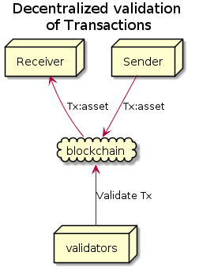
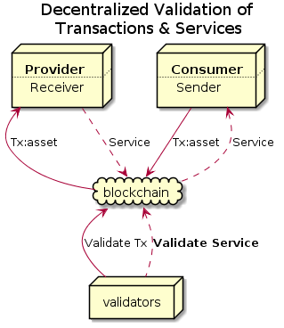

# PROV: General Proof-of-Work and decentralized service validation

liqing.pan@norchain.io

## Abstract

Projects are targeting to share remote resources. 

Few discussion regarding to the case if malicious consumer nodes deny the quality of such service. 

Few projects provide reasonable decentralized validation for the quality of services, leaving either consumer nodes or provider nodes the chances for cheeting.

Classic PoW of the task of hash calculation is hard to collide but easy to verify.  

## 1. Problem

One of the most important features of distributed ledger technology is to ensure incontestable transactions utilizing decentralized censensus algorithms. Cryptocurrency, acting as abstracted symbol of "value", has already widely flourished in the financial applications such as Bitcoin, ICOs and cryptocurrency exchanges in recent years. 

However, to further explore distribute ledger technology's potential, returning to the meaning of market economy, **the flow of currency should always accompanies with the flow of resources and services on the reversed direction**. In this case, the scenario comes to be more general in the following aspects:

|               | Current Projects | PROV                                   |
| ------------- | ---------------- | -------------------------------------- |
| Node Types    | Equivalent       | Different capacities and demands       |
| Message Types | Transaction      | Provision Orientation Validation |
|               |                  |                                        |

**Unequivalent Nodes** 

In conventional blockchain model, nodes are equivalent in capacity. 

Many projects try to make match the offchain decentralized services and use onchain transactions as the method of payment. Storj issues the proof-of-retrievability with service receipts posted on chain, but the procedure of validation are provided by centralized parties (the consumer). SIA host nodes send shards and hash periodically to chain, but not necessary to hold the whole original copy. 

 both with the decentralized validatable manner 

In real world, nodes have different capacities and demonds,  To enable the transactions more 

Some projects are also proposing  

## 1. Terminology

#### Service

In instance of service means the action of A to help or do work for B. 

In convensional bussiness model, a

Service means 

#### Roles

In the model of PROV, we basically have three key roles, 

#### Provider

#### Consumer

## 2. Decentralized service validation

## 2. PROV Service: Provision, Representation, Orientation and Verification 

### 2.1 Brief

Any service, no matter the consumer and provider parties come from human community or computer network, can be incontestably processed only when four __predefined__ phases achieved accurate consensus: Provision, Representation, Orientation and Verification.

**Provision**: Provider announces its capacities of handling particular services with the fee rates respectively. 

**Representation**: Consumer abstracts and refines the requirement from its raw demond, coming up with the standard representation of the task. A good representation should:

1. avoid any functional or qualitative dispution caused by indistinction or obscuration.
2. expose enough and just enough information to support the provider's service, in order to maximize privacy protection and minimize the cost of processing.

**Orientation**: Consumer compares the providers' offers, picks up the ones (can be shard) with his best interest and assigns the service to them. 

After orientation, the providers can untilize any resource and tactic to accomplish the task. In the service's point of view, there's no interaction, no regulation, no even suggestion. In this manner, providers are couraged to maintain competitiveness and innovate to increase profit.

**Verification**: After the providers believe the task is accomplished, an predefined verification should be performed. Similar as Representation, verification should avoid any functional or qualitative dispution caused by indistinction or obscuration. The evaluation also decides how to dispense the commission.

Need to mention, in a mature market model, the phases of P*rovision, Representation* and *Evaluation* are standardized between participated parties, leaving *Orientation* a dynamic process to consumer. In the following chapters, you'll see that in many user cases in a distributed ledger network, it's better to get *Orientation* process standardized and as well, in order to simplify the whole process, reduce on chain traffic and protect the providers from attacks. 

A distributed consensus network is **PROV compatiable**, if

1. every node  $k$ in this network has an asynmmetric key pair ($PU_k, PV_k$), where $PU_k$ is the public key (address) and $PV_k$ is the private key used for signiture. 
2. There's an universial currency to measure the value of service. There's a way to calculate the balance of each account. Denote the balance as $b_k$ for node $k$. 
3. Support deposit. Concretely, node $k$ can broadcast the message $M_D(PU_k, d, h ,\vec{\delta}|PV_k) $ 
3. there are $n$ types registered services {$S_n$}, $n \ge 1$. For any $i \in [1, n]$, define $S_i \equiv$  {$P_{S_i},R_{S_i}, O_{S_i}, V_{S_i} , PU_{a_i}, \vec{\psi_{S_i}}$}, where $P_{S_i},R_{S_i}, O_{S_i}$ and $V_{S_i} $ are the Provision, Representation, Orientation and Evaluation functions developed to support service $S_i$. $PU_{a_i}$ is $S_i$'s auther's address. $\vec{\psi_{S_i}}$ is $S_i$ specific parameters. We call $S_i$ a **PROV Service**.
4. Suggest supports *Sustainable Symmetric Key* introduced in *Chapter III*, but not mandatory.

### 2.2 PROV Service life cycle
In *PROV compatiable network*, A typical life cycle of instance $s \in S$ is described below:

1. The service provider node $p$ has resource $\vec{\nu}$ (Say storage size, flops, etc.), it estimates it's capacity of running $S$ by running $(\tilde{Cap}^{p}_{S},  \vec{\rho_{S}^p} ) = P_{S}(\vec{\nu})$. Here $\tilde{Cap}^{p}_{S}$ is calculated for $p$'s reference. $p$ boardcasts an provision message with it's capacity and rate, where $\vec{\rho_{S}^p} $ is service specific parameters. With $Cap^{p}_{S} $( $\le\tilde{Cap}^{p}_{S}$ ) along with rate $Rate^{p}_{S}$, the message is like: $M_{P}(PU_{p},Cap^{p}_{S},Rate^{p}_{S}, \vec{\rho_{S}^p} | PV_p) $.

2. Consumer node $c$ creates the service instance $s$ by excuting $R_{S}$. $(id_s,\vec{d_s},\vec{\alpha_s})=R_{S}(\vec{r_s})$, which preprocesses $c$'s raw input $\vec{r_s}$ to encrypt sensitive data, standalize the format to generate $\vec{d_s}$. $id_s$ is $s$'s universal id, $\vec{\alpha_s}$ is the answer vector, which can be used for evaluation later.

3. $c$ then calculate $(Vol_s, h_e, \{PU_{l_p}\}) = O_{S}(\vec{d_s}) $, where $Vol_s$ is the common estimation of $s$'s volume, $h_v$(a.k.a. **Verification Height**) is the block height deadline for evaluation, and $\{PU_{l_p}\}$ is a list (length $l_p$) of  recommended provider's address selected by an algorithm powered by a pseudo-randomizer with the seed generated by $\vec{d_s}$. In most cases, $O_{S}$create a list $L_{S}^{P}$ with the addresses of all the providers of $S$ by filtering the nodes with $Cap_{S} \gt 0$, then iterate every provider $p_j$ with following steps:

   * Filter out $p_j$ if it's available capacity is less than $Vol_s$. Concretely, say $p_j$ is already working on $l_j$ instances of $S$ with the volumes of $\{Vol_{l_j}\}$,  filter it out if  $ Cap^{p_j}_{S} - \Sigma Vol_{k} \lt Vols $ 

   * The fee $p_j$ required for task $s$ is calculated by $f(s,p_j) = Rate_{S}^{p_j} \cdot Vol_s$. Filter out $p_j$ if $f(s,p_j) \gt _c$,b since $c$ doesn't have enough balance to pay $p_j$ to run $s$.

   * one straightforward practise is to pick $\{p_j\}$ where $f(s,p_j)$ has the minimum values (The cheapest ones). Actually, there are other tactics to make more reasonable $O_{S}$ utilizing other information recorded on chain. *e.g.* taking the evaluation result from the blockchain of $p_j$'s last 10 services into account, or weight $p_j$'s experience history, etc.

   * $O_{S}$ must utilize a pseudo-randomizer, otherwise it will be easy for the hackers to launch DDoS attack to $p$. If the developer failed to follow this practise, the service is vulnerable and no provider would mount it.

   After all these, $c$ boardcasts the orientation message $M_{O}(PU_c,id_s, \vec{d_s}, \vec{\alpha_s}|PV_c)$. Other nodes including selected providers (such as $p$) will get to know $s$ is assigned by calculating $O_{S}(\vec{d_s}) $. 

   To verify $M_{O}$ during confirmation, bookkeeper nodes should:

   * Check the signiture. If invalid, return false.
   * Run $(Vol_s, \{PU_p\}, h_e) = O_{S}(\vec{d_s}) $, check if $p$ has enough available capacity. If not, return false.
   * Check if $c$ has enough balance. if not, return false.
   * Check if $\vec{d_s}$ is valid. This is a service specific process.

   If everything goes right, $M_{O}$ is recorded into ledger (Say on the height $h_0$). $f(s,p)$ is frozen from $c$'s account immediately.

5. $p$ is supposed to give out a result vector $\vec{z_s}$  before $h_0+h_e$ reached. $p$ can evaluate it's temporary $\vec{\zeta}$ anytime by running $({\upsilon}_s, c_{p_s},c_{a_s} )= V_{S}(\vec{d_s},\vec{\zeta}, \vec{\alpha_s} )$, where ${\upsilon}_s \in [0,1]$ represents the score of $p$'s service. $c_{p_s}$ and $c_{p_s}$ are the presumed service fee deposit to $p$ and $a_i$ 's account. The author $a_i$ can design $V_{S}$ to support boolean output 0 and 1 to represent only the status of success and failure. 

   There's no fixed function to restrict what should $p$ process to get $\vec{z_s}$, It's free for $p$ to leverge any offchain solution or resource on $s$. But since lack of knowledge of  $\vec{r}$, $p$ cannot leverage $R_{S}$. 

   Once $p$ thinks $\vec{z}$ is OK, it boardcasts the message $M_{V}(id_s, \vec{z}|PV_p) $. 

   Then bookkeepers should check 

   * if latest block height is lower than $h_0+ h_e$. If yes, record the message into ledger. Otherwise just ignore it.
   * if 51% $l_{p}$ of the selected providers return same $\vec{z}$. 

   By calculating $(v_s, c_{p_s},c_{a_s} )=E_{S}(\vec{d_s},\vec{z_s}, \vec{\alpha_s} ) $, the amount of $f(s,p)$ is unfrozen in $c$'s account, and $ c_{p_s}$ and $c_{a_s}$ are transfered to $p$ and $a_i$ respectively. 

   The whole life cycle of $s$ is finished.

## 3. Solutions of some common scenarios

### 3.1 Large input 

One common challenge is that many types of services requires the consumer to pass large size data to provider to process. Distributed ledger network with the nature of being a "ledger", is neither expected nor feasible to keep large size data. Some off-chain assisted mechanism should be introduced to insure such data is successfully transferred.

Say service $S$ has  $\vec{r} = \{\vec{\gamma},\vec{\tau}\}$ where each element of  $\vec{\tau}$ contains large size data, while each element of  $\vec{\gamma}$ has small size data. $S$ should:

1. Design $R_S$ and $O_S$ to calculate $Vol_s$ irrelative with $\vec{\tau}$.  If $Vol_s$ is related with some features of $\vec{\tau}$ (say the size), just put the feature values as elements of  $\vec{\gamma}$
2. $S$ is better not to support manually provider pick up to avoid DDoS. 
3. Providers should put it's off-chain server addresses into $\vec{\rho_{S}} $ in $M_{provision}$.

When consumer $c$ is creating the new service instance $s$, $D_S$ with input  $\vec{r}$ goes through following steps:

1. use the same algorithm of $N_s$ to calculate $Vol_s$ and pick $p$ with an algorithm pseudo-randomized by timestamp $t$.  
2. checks if *SSK* (See Chapter 1) between $p$ and $c$ is already created. If not, create it. 
3. encrypt $\vec{\tau'} = E(\vec{\tau}, SSK(s,p))$. Post $\vec{\tau'} $ with $p$'s off-chain API, $p$ returns $id'_s$ to track $ \vec{\tau'} $ . If error happens, go to step 1 and another provider will be picked.
4. Calculate $\vec{d_s} = \{N'_s(\vec{\gamma}),  id'_s, \epsilon, t\}$.  $N'_s$ is used to process small size parameter $\vec{\gamma}$.  $\epsilon = CS(\vec{\tau'})$ is checksum.

$c$ sends $M_{service}$ out. When bookkeepers verify $M_{service}$, they query $p$'s off-chain API with parameter $id_s'$ and its signiture, and get back  $\vec{\tau'}$, check if the checksum matches with $\epsilon$. Record the $M_{service}$ into blockchain then. If any error, just ignore it. The next bookkeepers will try verify $M_{service}$ until $h_0+ h_e$ reached. If so,  $c$ can reinitiate $s$ again.

 $p$ only opens the GET API to the chain node (verified via signatures), and limit the number of queries for particular $id'_s$ with the maxmium confirmations necessary (say 6 for Bitcoin and 12 for Ethereum), except $c$.  

Since $\vec{\tau'}$ is encrypted, bookkeepers can do nothing with it except validation. $p$ can decrypt the data and excute the service.

### 3.2 Privacy with the service provider

From 3.1 we can see SSK can provide good protection from the parites other than $c$ and $p$. But the question is: Is it possible to even protect the privacy from $p$? The answer is yes if the author of the service have a good design to split $\vec{r}$ into subsets, create a set of service instances, and none of the providers can see the whole picture.

### 3.3 Resolve NP-Complete problems

There are many discussions regarding 

### 3.4 Endurance

[TODO: Sharding verification. Order and answer already in $\vec{a}$]

Many services requires the providers to keep serving for a particular long time. e.g. $c$ wants to rent $p$'s storage to hold his video for one whole month. 

In this case, by defining extra parameter in $E_S$, we can have bookkeepers to

1.  Verify $M_{resolve}$ whenever need to  

## 4. Example Scenarios  

 ### 4.1 Cloud mining 

$c$ wants to mine POW cryptocurrency $\Gamma$, whose block cycle is larger than that of our network. $c$ finds there's a service called $S_{mine}$ to provide general mining service. So $\vec{r_s} = (\Gamma, B_h)$, while $\Gamma$ is the symbol and $B_{h0}$ is the block content of height $h$. $D_{S_{mine}}$ returns standard hash function request, and $\vec{a}$ is the nounce.  

### 4.2 Gradient descent

$c$ is researching deep learning and has a neural network to train. This is a typical Large Input scenario. $c$ pass the encrypted NN structure and training/testing set to $p$ through offchain channel. 

[TODO]

## 5. Prerequisite

### 1.1 Sustainable Symmetric Key

By leveraging the power of distributed ledger, the conventional secured connection techniques such as HTTPS/SSL can be drastically simplified. 

Say we have $N_A$ and $N_B$ with the public key and private key to be ($PU_A$,$PV_A$) and ($PU_B$, $PV_B$) respectively,  the below steps are only required to be excuted only once for all. 

1. $N_A$ generate a symmetric key $K_S$ (a.k.a. **Sustainable Symmetric Key** or **SSK** ). 
2. $N_A$ uses asymmetric algorithm $E$,  $PU_B$, metadata $\lambda$ and signiture function $Sig$ to generate the message $M = Sig(E(PU_B, \lambda),PV_A)$ , then boardcasts $M$ to blockchain. 

After that, $N_A$ and  $N_B$ can use $K_S$ to secure the traffic for unlimited times, without asymmetric handshake, no matter the traffic is onchain or offchain. 

To reset SSK due to key leakage or version upgrade, $N_A$ can simple repeat the above steps. $N_B$ always takes the latest one.

