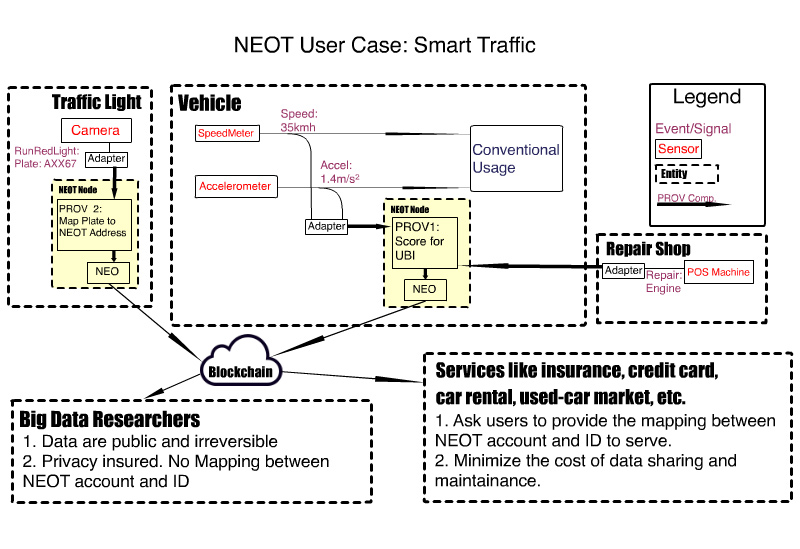

# NEO of Things (NEOT) 

The IoT Infrastracture powered by NEO

[TOC]

## Abstract

Internet of Things (IoT), has recently gained much traction due to its potential for transforming business applications and everyday life. However, it's encountering many practical problems such as security, privacy, compatibility and statability. Distributed ledger technology emergying recently brings the hope of enhancing IoT network in many aspects. 

The project NEOT (NEO of Things), powered by both NEO's blockchain platform and PROV's innovational service model and tool set, is aimed to overcome some most critial IoT practical problems, especially in the scenario of sharing economy. 

## Documents

* [NEOT White Paper](https://github.com/NEOCompToronto/NEOCompetition/blob/master/NEOT%20-%20White%20Paper.md): In this white paper, we first discuss the common challenges of distributed ledger based IoT projects, then introduce a new blockchain based service model PROV to help overcome some practical problems. The project NEOT (NEO of Things) is proposed to leverage PROV service model and NEO blockchain. In the last, we discuss some NEOT user cases in the smart traffic scenario. 
* [PROV Yellow Paper](https://github.com/NEOCompToronto/NEOCompetition/blob/master/PROV%20Service%20and%20Share%20Economy.ipynb): In this yellow paper, we make a indepth discussion in technology perspective about an optimized blockchain share economy model: PROV. The role **PROV developer** as an independent party is introduced to decouple service providers from implementing services. PROV developer provides customers more flexibility in deciding how providers can serve them with their resources, and get profit from every instance of the service they created. By utilize blockchain infrastructure, PROV developers can retrieve useful information from the irreversible ledger to optimize their service. 

The team of [norchain.io](http://www.norchain.io/) has widely launched conversation with City of Marham, CGI Group, China Mobile, regarding to blockchain opportunities of contributing smart economy. Such as the Smart Traffic model proposed to City of Marham as showing in the above picture.

## Website

[HERE](http://www.norchain.io/neot/neot.html) is the official site of NEOT, where you can find more materials, such as a Smart Traffic showcase and introduction video.

The project of NEOT is initiated, developed and maintained by the team [norchain.io](http://www.norchain.io/). 

The project of NEOT is also a part of norchain's proposal of [1st NEO Dev Competition](https://neo.org/competition.html).