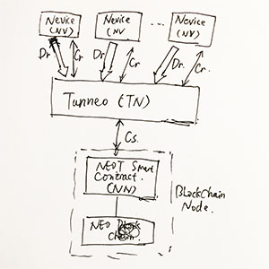

# NEO of Things (NEOT) 

The IoT Infrastracture powered by NEO

[TOC]

## 0. Abstract

The project of NEO of Things (a.k.a NEOT ) initiated by [Norchain](www.norchain.io) team aimed to … {TODO}

## 1. Challenges of IoT

{TODO: To finish this section, can mainly cite the following two aricles coming from IEEE IoT}

	1. [IoT+BlockChain: Benefits and Challenges](https://iot.ieee.org/newsletter/january-2017/iot-and-blockchain-convergence-benefits-and-challenges.html)
	2. [IoT Trends 2018](https://iot.ieee.org/newsletter/january-2018/iot-trends-in-2018-ai-blockchain-and-the-edge.html?highlight=WyJibG9ja2NoYWluIl0=)

### 1.1 Device capability limitation

Most IoT nodes have limited storage and calculation power. The consensus algorithms
employed in BC (POW or POS) require significant computational resources which are far beyond the capabilities of most IoT devices. {TODO. NOTE: Can also cite some ideas from these two articles in other sessions.} [LINK1](https://arxiv.org/pdf/1712.02969.pdf), [LINK2](https://arxiv.org/pdf/1608.05187.pdf)

Ethereum's light client protocol is still under development [LINK](https://github.com/ethereum/wiki/wiki/Light-client-protocol). 

### 1.2 DDoS attack resistant

IoT has already turned into a serious security concern that hackers can produce DDoS attacks.  {TODO}  [LINK1 ](https://www.iotforall.com/5-worst-iot-hacking-vulnerabilities/) 

Blockchain technology leveraging randomlized peers brings the potiential of DDoS-resistant. {TODO} [LINK](https://venturebeat.com/2017/06/25/how-blockchain-based-apps-and-sites-resist-ddos-attacks/)  ( *Paragram: Attacking the miners directly is close to impossible. They do their work behind a peer-to-peer network designed to resist any sort of direct attack called the Bitcoin protocol. Peer-to-peer networks are notoriously hard to stop or even disrupt. Attacking the transactions is also close to impossible because they are stored in everyone’s copy of the blockchain and cryptographically verified by the mining process.*) 

### 1.3 Connection stability

{TODO} [LINK](https://iot.ieee.org/newsletter/january-2017/iot-and-blockchain-convergence-benefits-and-challenges.html)

### 1.4 Compatibility

{TODO} [LINK](https://iot.ieee.org/newsletter/march-2017/three-major-challenges-facing-iot.html) (Refer to **Standard** session:*Technology standards which include network protocols, communication protocols, and data-aggregation standards, are the sum of all activities of handling, processing and storing the data collected from the sensors* ) 

Blockchain tech provides a chance to make message level standardization. {TODO}

### 1.5 Challenges of recent IoT blockchain projects  

Some IoT projects are experimenting other decentralized topology. The most famous one is IOTA. However, its light nodes rely on [manual assigning public nodes as servers](https://www.iotasupport.com/lightwallet.shtml), which recently practially failed to resist DDoS attacks {TODO} [LINK](https://freedman.club/en/cryptocurrency-iota-ddos-attack-revealed-the-problem-of-network-scalability/) 

ITC doesn't have much process on their project {TODO} [LINK](https://steemit.com/blockchain/@smcaterpillar/iot-chain-china-s-new-iota-an-easy-investment-or-should-we-set-off-the-alarm-bells-let-s-do-our-homework). It's based on Ethereum, which means low speed and you need to pay gas for every conversation, which is not applicable for most IoT scenarios. 

Steemr, providing beautiful user interface, is targeted to provide a market for offchain stream data. It's also based on Ethereum. Their network is so far running totally offchain with nothing about the their ERC20 token. {TODO: The last Q/A} [LINK](https://blog.streamr.com/2018/02/faq-streamr-ethereum-network/)

## 2 NEOT: The First Practical IoT Solution Powered by Blockchain

### 2.1 NEOT network components

Key components in NEOT's network includes following:

#### Sensor 

*Sensor* is the ultimate information capturer of the really world and the terminal of existing IoT networks. A typical *sensor*:

2. has unidirectional **Data** output, with the form of pulsing, streaming, etc. The encoding of *data* may or may not conform to international standards. 
2. has an instruction set for remote configuration and controlling. Some also implement the status query functionalities and the feedback/acknowledge machanism. We define this set as bidirectional **Signals**. 
3. is not designed to handle heavy computational work or persist huge volume of data, in order to reduce the battery consumption and hardware cost.
4. in many scenarios, is exposed in unstable communication environment. 
6. in many scenarios, pair with, or as an element of a *sensor* cluster connect with a **Sensor Delegate**. The *delegate*, which can be a specialized hardware, or an API mounted in a common device, also provides *data* and *signal* interfaces.

NEOT node can attach multiple *sensors* or *sensor delegates*. A node with more than one 

#### Nest

*Nest* is a device equiped with significant computational power (a.k.a. **Computation Nest**) or data storage capacity (a.k.a. **Storage Nest**), or simply providing human-computer interface (a.k.a **HCI Nest**). *Nest* interact with NEOT node with the very similar way of *sensor*/*delegate*. It acts as the service provider in *Private Data* user cases, while the consumer in *Public Data* user cases. Check session 2.2 for these user cases.

#### Adapter

*Adapter* is a customizable component connecting *sensor*/*delegate* and NEOT node. *Adapter* confirms **NEOT Protocol** with a standardized *data* and *signal* interface to communicate with NEOT node via *Tunneo*.

*NEOT Protocol* is open to 3rd party, such as sensor manufacturers and indie developers. Everyone who is willing to connect their IoT devices to NEOT to leverage the power of blockchain is free to join in, no permission necessary. We call these Developers as **Adapter Devs**.

Once released, *NEOT Protocol* will be updated very occasionally, in order to reduce the re-development and re-deployment cost of *adapter devs*. However, *adapter devs* are always free to update and deploy their *adatper* anytime.

#### Tunneo

*Tunneo* (a.k.a TN) as a part of NEOT node, provides following functionalities:

* Realize *lifetime trnasport layer security*. Refer to session 2.2 for more details. 
* Encrypt the data and *signal*
* Realize the offchain channel between *Nest* and *Sensor* nodes.

### 2.2 Lifetime Transport Layer Security   

### 2.3  

## 3. IoT blockchain: Why NEO

See following table comparing Ethereum, IOTA and NEO, by the means of IoT application.

|                                        | Ethereum                                                     | IOTA                                                         | NEO                        | Comment                                                      |
| -------------------------------------- | ------------------------------------------------------------ | ------------------------------------------------------------ | -------------------------- | :----------------------------------------------------------- |
| Light Node                             | [Developing](https://github.com/ethereum/wiki/wiki/Light-client-protocol) | Supported                                                    | Supported                  | *Light Node* stands for the nodes run without keeping ledger copies or PoW computation, which is suitable for IoT devices. |
| Connection between Light and Full Node | N/A                                                          | [Can Manually Assign](https://www.iotasupport.com/lightwallet.shtml) | Randomly Chosen            | The more connections randomized and decentralized, the more the IoT network can be DDoS resistant. |
| DApp support                           | Supported: Solicity                                          | N/A                                                          | Supported: Major languages | Open and developer-friendly eco-systems can attract more allies, by the means of both technology and investment. Also provides more flexibility to fit particular IoT scenarios. |
| Tx/Messaging Fee                       | GAS                                                          | Free                                                         | Free                       | IoT network requires way more large amount of transactions. Better to reduce   the friction. |
| TPS                                    | 15                                                           | 1000                                                         | 1000                       | IoT requires quicker transaction network                     |
| Number System                          | Binary                                                       | Ternary                                                      | Binary                     | Ternary could be the future of computing [LINK](https://iota.stackexchange.com/questions/8/why-does-iota-use-a-ternary-number-system) rather than just extra computational overhead, only if manifacturers rewrite their binary architectures. However, even the IoT communication standardization couldn't get aligned in the past decades. |
| Bookkeeper Incentive                   | Mining/Transaction reward                                    | No Incentive                                                 | Most by Dev team           | Incentive makes the network more stable                      |

As a conclusion, we see NEO has the advantages as...{TODO: A summary of the table above to describe NEO's advantage in implementing IOT}. There are also other concerns of IOTA that we can see from [HERE](https://hackernoon.com/why-i-find-iota-deeply-alarming-934f1908194b)