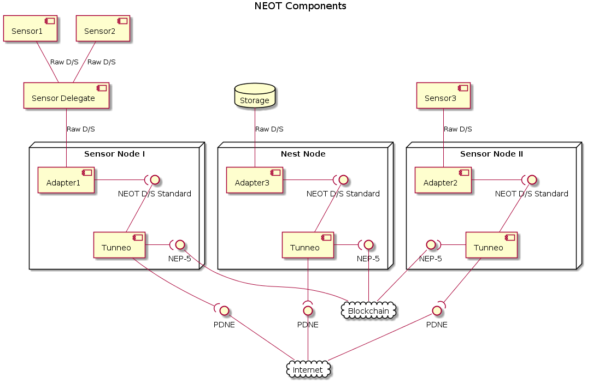
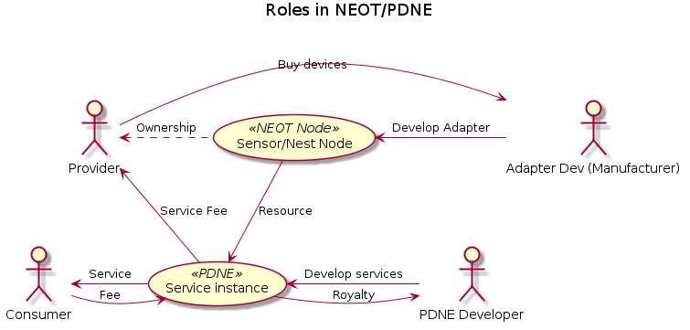

# NEO of Things (NEOT) 

The IoT Infrastracture powered by NEO

[TOC]

## 0. Abstract

As the Submission of NEO's competiton, we have:

### 0.1 The proposal of NEOT 
This article itself. The project of NEO of Things (a.k.a NEOT ) initiated by [Norchain](www.norchain.io) team aimed to … {TODO}
### 0.2 A prototype of NEOT NEP-5 smart contract 
{TODO: Need discribe what's in there}

### 0.3 A demo of NEO based UBI 

{TODO: Build by Unity} the senario …  

### 0.4 A video 

{TODO}

### 0.5 Intro of the team

Norchain team ….

We are contact with Marham government to do ….

We have relationship with Huawei to utilize NB-IoT … 

We contacted with China mobile ...

## 1. Challenges of IoT and related projects

{TODO: To finish this section, can mainly cite the following two aricles coming from IEEE IoT}

	1. [IoT+BlockChain: Benefits and Challenges](https://iot.ieee.org/newsletter/january-2017/iot-and-blockchain-convergence-benefits-and-challenges.html)
	2. [IoT Trends 2018](https://iot.ieee.org/newsletter/january-2018/iot-trends-in-2018-ai-blockchain-and-the-edge.html?highlight=WyJibG9ja2NoYWluIl0=)

### 1.1 Node capability

Most IoT nodes have limited storage and calculation power. The consensus algorithms
employed in BC (POW or POS) require significant computational resources which are far beyond the capabilities of most IoT devices. {TODO. NOTE: Can also cite some ideas from these two articles in other sessions.} [LINK1](https://arxiv.org/pdf/1712.02969.pdf), [LINK2](https://arxiv.org/pdf/1608.05187.pdf)

Ethereum's light client protocol is still under development [LINK](https://github.com/ethereum/wiki/wiki/Light-client-protocol). 

### 1.2 DDoS attack

IoT has already turned into a serious security concern that hackers can produce DDoS attacks.  {TODO}  [LINK1 ](https://www.iotforall.com/5-worst-iot-hacking-vulnerabilities/) 

Blockchain technology leveraging randomlized peers brings the potiential of DDoS-resistant. {TODO} [LINK](https://venturebeat.com/2017/06/25/how-blockchain-based-apps-and-sites-resist-ddos-attacks/)  ( *Paragram: Attacking the miners directly is close to impossible. They do their work behind a peer-to-peer network designed to resist any sort of direct attack called the Bitcoin protocol. Peer-to-peer networks are notoriously hard to stop or even disrupt. Attacking the transactions is also close to impossible because they are stored in everyone’s copy of the blockchain and cryptographically verified by the mining process.*) 

### 1.3 Connection stability

{TODO} [LINK](https://iot.ieee.org/newsletter/january-2017/iot-and-blockchain-convergence-benefits-and-challenges.html)

### 1.4 Compatibility

{TODO} [LINK](https://iot.ieee.org/newsletter/march-2017/three-major-challenges-facing-iot.html) (Refer to **Standard** session:*Technology standards which include network protocols, communication protocols, and data-aggregation standards, are the sum of all activities of handling, processing and storing the data collected from the sensors* ) 

Blockchain tech provides a chance to make message level standardization. {TODO}

### 1.5 Recent IoT distributed ledger projects  

Some IoT projects are experimenting other decentralized topology. The most famous one is IOTA. However, its light nodes rely on [manual assigning public nodes as servers](https://www.iotasupport.com/lightwallet.shtml), which recently practially failed to resist DDoS attacks {TODO} [LINK](https://freedman.club/en/cryptocurrency-iota-ddos-attack-revealed-the-problem-of-network-scalability/) There are also other concerns of IOTA that we can see from [HERE](https://hackernoon.com/why-i-find-iota-deeply-alarming-934f1908194b)

ITC doesn't have much process on their project {TODO} [LINK](https://steemit.com/blockchain/@smcaterpillar/iot-chain-china-s-new-iota-an-easy-investment-or-should-we-set-off-the-alarm-bells-let-s-do-our-homework). It's based on Ethereum, which means low speed and you need to pay gas for every conversation, which is not applicable for most IoT scenarios. 

Steemr, providing beautiful user interface, is targeted to provide a market for offchain stream data. It's also based on Ethereum. Their network is so far running totally offchain with nothing about the their ERC20 token. {TODO: The last Q/A} [LINK](https://blog.streamr.com/2018/02/faq-streamr-ethereum-network/)

## 2 NEOT: The 1st Practical IoT Blockchain Solution

### 2.1 Key components

Key components in NEOT's network includes following:

#### Sensor 

*Sensor* is the ultimate information capturer of the really world and the terminal of existing IoT networks. A typical *sensor*:

1. has unidirectional **Data** output, with the form of pulsing, streaming, etc. The encoding of *data* may or may not conform to international standards. 
2. has an instruction set for remote configuration and controlling. Some also implement the status query functionalities and the feedback/acknowledge machanism. We define this set as bidirectional **Signals**. 
3. is not designed to handle heavy computational work or persist huge volume of data, in order to reduce the manufacture cost and battery consumption.
4. in many scenarios, is exposed in unstable communication environment. 
5. in many scenarios, pairs with, or as an element of a *sensor* cluster connects with a **Sensor Delegate**. The *delegate*, which can be a specialized hardware, or an API mounted in a common device, also provides *data* and *signal* interfaces. In the NEOT's point of view, *sensor delegate* is equivalent to *sensor* as they both provide bidirectional signal and unidirectional data interfaces. Therefore we see these delegates as "sensors" to simplify the description.

One NEOT node is capable to attach multiple *sensors*. A node attached with at least one *sensor*  is call a NEOT **Sensor Node (SN)** .

*Sensor nodes* act as the service provider in *Private Data* user cases, while the consumer in *Public Data* user cases. Check session 2.5 for the details of these user cases. 

#### Nest

*Nest* is a device equiped with significant computational power (a.k.a. **Computation Nest**) or huge storage capacity (a.k.a. **Storage Nest**), or simply providing human-computer interface (a.k.a **HCI Nest**). *Nest* interact with the rest of NEOT node with very similar way as the *sensors* in *Sensor Nodes* except that the data flow can be bidirectional. *Nest* Nodes acts as the service provider in *Private Data* user cases, while the consumer in *Public Data* user cases. Check session 2.5 for the details of these user cases. 

One NEOT node can attach multiple *nests*. There could be **Nest Delegates** but we see them as *nests* with the same reason on *sensor delegates*.  A node with at least one *nest* attached is called a NEOT **Nest Node**. In the rest of this article, we also call *sensor* and *nest* the **Terminals**. 

#### Tunneo

*Tunneo* (a.k.a TN) is a PDNE compatible layer open to serivce developers. 

NEOT developer team will participate partially by providing some toolset SDK used for standalized *data* and *signal* I/O portal and encapsulate common on-chain and off-chain tasks. 

NEOT developer team will upgrade the SDK regularly to fix the defects and enhance it's functionality.

For more information about what PDNE protocol can do, please refer to {TODO}

#### Adapter

*Adapter* is a customizable component connecting *terminals* and *Tunneo*. *Adapter* implements **NEOT Interfaces**, and provides standardized *data* and *signal* with NEOT node via *Tunneo*.

*NEOT Protocol* is open to 3rd party, such as terminal manufacturers and indie developers. Everyone who wants to connect their IoT devices to NEOT to leverage the power of blockchain and PDNE service is free to join in, no permission required. We call these developers as **Adapter Developers**.

Once released, *NEOT Protocol* will be kept fixed except serious issue founded, providing *adapter developers* the best flexibility and reduce their cost of forced updates or re-deployment.

### 2.2 NEOT Features   

The structure of NEOT 

#### Motivate all parties

Leveraging the power of PDNE standard, there are mainly four parties in NEOT's network: Providers, Consumers, Adapter Developers, PDNE Developers. Each parties would be motivated to improve the ecosystem. The above figure demonstrates the flow of the value following the arrow's direction:

*Consumers* pays fees for the PDNE services provided by NEOT Node. *PDNE Developers* write 

Manufacturers and indie developers who want to connect their IoT devices to NEOT can implement the 

Although it's a great aspiration that we put all the *signal* or even *data* generated throughout the network into blockchain, we must admit that it's impratical today due to the reasons discussed in session 1.5, even many chain consensus algorthims partcially sacrifice the character of decentralization to enhance the speed and to reduce the ledger size. The problem is especially serious for IoT applications because of the node capacity limitations.

Nevertheless, we agree that the blockchain performance and IoT node capacity will continue improve in the further. So why not migrate the business onto the chain gradually?

With this approarch, the work of inital versions of *tunneo* will tend to support the less frequent and small sized user cases. Such as transaction and scoring. 

### 2.5  Scenario: Nest Rental 

Task: Node *A* to find a qualified nest node to finish a particular 

### 2.6 Scenario: Data Sharing

### 2.7 Scenario: Remote Access 

### 2.8 Blockchain: Why NEO

See following table comparing Ethereum, IOTA and NEO, by the means of IoT application.

|                                        | Ethereum                                                     | IOTA                                                         | NEO                        | Comment                                                      |
| -------------------------------------- | ------------------------------------------------------------ | ------------------------------------------------------------ | -------------------------- | :----------------------------------------------------------- |
| Light Node                             | [Developing](https://github.com/ethereum/wiki/wiki/Light-client-protocol) | Supported                                                    | Supported                  | *Light Node* stands for the nodes run without keeping ledger copies or PoW computation, which is suitable for IoT devices. |
| Connection between Light and Full Node | N/A                                                          | [Can Manually Assign](https://www.iotasupport.com/lightwallet.shtml) | Randomly Chosen            | The more connections randomized and decentralized, the more the IoT network can be DDoS resistant. |
| DApp support                           | Supported: Solicity                                          | N/A                                                          | Supported: Major languages | Open and developer-friendly eco-systems can attract more allies, by the means of both technology and investment. Also provides more flexibility to fit particular IoT scenarios. |
| Tx/Messaging Fee                       | GAS                                                          | Free                                                         | Free                       | IoT network requires way more large amount of transactions. Better to reduce   the friction. |
| TPS                                    | 15                                                           | 1000                                                         | 1000                       | IoT requires quicker transaction network                     |
| Number System                          | Binary                                                       | Ternary                                                      | Binary                     | Ternary could be the future of computing [LINK](https://iota.stackexchange.com/questions/8/why-does-iota-use-a-ternary-number-system) rather than just extra computational overhead, only if manifacturers rewrite their binary architectures. However, even the IoT communication standardization couldn't get aligned in the past decades. |
| Bookkeeper Incentive                   | Mining/Transaction reward                                    | No Incentive                                                 | Most by Dev team           | Incentive makes the network more stable                      |

As conclusion, we see NEO has the advantages as...{TODO: A summary of the table above to describe NEO's advantage in implementing IOT}. 

## 3 Smart Economy User Cases 

### 3.1 Usage-based insurance 

Intro of conventional UBI {TODO} [LINK](https://en.wikipedia.org/wiki/Usage-based_insurance) 

Brief user case decription {TODO: Describe the user case in below picture}

1. NEOT node is embeded in the car hooking with sensor 1,2,3,...
2. Algorthim of scoring is coded in Tunneo, the calculation process...
3. Charge through blockchain

Technique explaination of how blockchain works in these scenario {TODO: Describe the below picture}

1. Multiple nodes via vehicle, mobile, difficult carrier provider, insurance company
2. Use bluetooth, LTE network, NB-IoT chip, fiber network,etc.. 

Further expansion {TODO: Describe the below picture}

1. Sensors can be outside of the vehicle. eg. POS machines of repair shop, NFC with traffic camera, etc.
2. Following above bullet, auto payment of the bill and tickets.

### 3.2 Smart Traffic

3.1 is just one corner of the whole picture. 

{Some people suggests the Smart City and Sharing Economy [LINK](https://www.springeropen.com/track/pdf/10.1186/s40854-016-0040-y?site=jfin-swufe.springeropen.com)}

{TODO: Tiger, retrieve some idea from the article I shared to you on weChat}

Further, we can  {TODO: Tiger can refer to our wechat conversation to complete this part}

1. The scoring and incident history of the addresses are public on blockchain with standard format. big data experts can use these data for free and help improve our traffic system. 
2. Meanwhile, since the relationship between the blockchain node and real world car is confidential, it will be transparent that individuals' privacy is ensured. 
3. It'll also be a huge save of mantainance cost for the KYC based services, such as banks, insurance company etc. who need to check individual's related history. They just need to temporary ask users to provide the prove of the ownership of the account and retrieve information from blockchain.
4. …. 

{TODO: Tiger, add more content if necessary}

​**Better Consider as the proposal of "Smart City"** {TODO}

1. Use figures to demonstrate the add-on parts upon current system. So city could understand we are trying reduce the cost.  